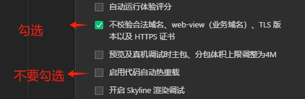

## 采用tarojs 4.x

tarojs 4.x 版本，使用nutui组件库

tarojs 官网：https://docs.taro.zone/docs/

组件库：https://nutui.jd.com/taro/vue/4x

## 小程序本地配置

> mac 开发者工具请安装 1.06.250版本

1. npm run dev的时候， taro已经支持了热加载，所以请不要勾选“启用代码自动热重载”，否则会导致小程序编译不会自动更新。

2. 勾选“不校验合法域名、web-view（业务域名）、TLS版本以及HTTPS证书”才可以本机调试接口。



## 安装和运行

> 先解压`project.private.config.json.zip`

```bash
pnpm i

# mock启动
npm run dev:mock

# test环境启动
npm run dev:test

# prod环境启动
npm run build:prod
```

# kill port

```bash
# windows
netstat -ano | findstr :9300

# linux
lsof -i :9300

taskkill /PID 20228 /F
```